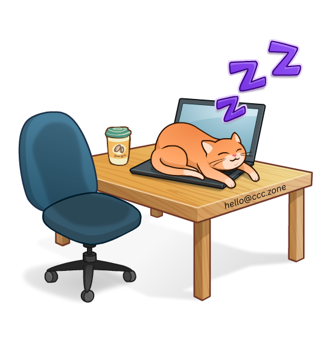

# Hi, I'm Santiago 

 

### WEB & MOBILE DEVELOPER

 
  
- 🌐 Exploring new **web** tech
- 📚 **Cloud** & **deployment** learning
- 🛠️ **Automating** dev processes
- 📱 **Mobile** app dev
- 🧠 **ML** & **AI** exploration
- 🌱 Professional **growth**
- 💼 Entrepreneurship & **startup** creation
- 💡 Problem-solving **passion**
- 🚀 Community **contributions**
- 💻 Staying updated & **best practices**

 
 

### Connect with me: <a href="mailto:hello@ccc.zone"><h1>hello@ccc.zone</h1></a>

 

### Languages, Frameworks & Libraries:

 &nbsp;
 &nbsp;
 &nbsp;
 &nbsp;
 &nbsp;
 &nbsp;
 &nbsp;
 &nbsp;
 &nbsp;
 &nbsp;
 &nbsp;
 &nbsp;
 &nbsp;
 &nbsp;
 &nbsp;
 &nbsp;
 &nbsp;
 &nbsp;
 &nbsp;

 

### Tools & other stuffs:

 &nbsp;
 &nbsp;
 &nbsp;
 &nbsp;
 &nbsp;
 &nbsp;
 &nbsp;
 &nbsp;
 &nbsp;

 
